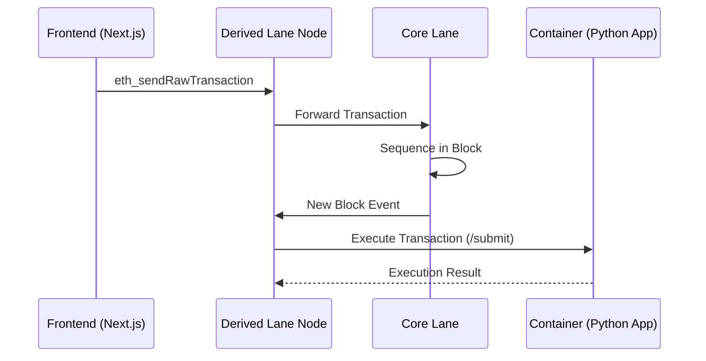

# NFT Lane - A Simple Derived Lane for LaneLayer

A demonstration of a derived lane on LaneLayer that allows minting and managing NFTs.

## What is This?

This is a simple NFT minting application built as a **derived lane** on LaneLayer. It demonstrates how to:

- Build a containerized application that receives transactions from Core Lane
- Process NFT minting requests
- Serve a web interface for interacting with the lane
- Deploy to production using the LaneLayer CLI

## Features

- **Process NFTs**: Processes NFT minting requests through the `/submit` endpoint
- **Core Lane Integration**: Receives transaction data via the `/submit` endpoint
- **Single Entry Point**: Follows LaneLayer pattern with `/submit` as the only data entry point
- **Health Monitoring**: Exposes `/health` endpoint required by LaneLayer CLI

## Architecture & Data Flow

### Verified End-to-End Flow

The system is fully integrated and functioning as follows:

1.  **Submission**: User signs a transaction in the Frontend (Next.js).
2.  **Entry Point**: The transaction is sent to the Derived Lane RPC (`http://127.0.0.1:9545`).
3.  **Forwarding**: The Derived Lane Node forwards the transaction to the Core Lane RPC (`http://127.0.0.1:8546`).
4.  **Sequencing**: Core Lane includes the transaction in a Bitcoin-anchored block.
5.  **Execution**: The Derived Lane node reads the new block from Core Lane and processes the transaction (executing the Python logic in the container).



### Component Roles

- **Frontend**: Handles user input and transaction signing. Proxies requests to bypass CORS.
- **Derived Lane Node**: Acts as the RPC gateway and the execution engine. It manages the connection to Core Lane.
- **Core Lane**: The settlement layer. It orders transactions and provides data availability.
- **Container**: The application logic (Python). It receives standardized HTTP calls from the Derived Lane node.

### Current Integration Status

**✅ Fully Functional**:

- Frontend minting works.
- RPC connection and forwarding works.
- Core Lane sequencing works.
- Container execution works.

## Quick Start

### Prerequisites

- Docker and Docker Buildx
- Node.js and npm (for LaneLayer CLI)
- [LaneLayer CLI](https://github.com/lanelayer/cli) installed globally

### Installation

1. Install the LaneLayer CLI:

```bash
npm install -g @lanelayer/cli
```

2. This project was created using:

```bash
lane create nft-lane --template python
```

### Production Deployment

Follow these steps to deploy the full LaneLayer stack with Bitcoin anchoring.

#### 1. Start the Backend Infrastructure

Open a terminal and start the Core Lane and Derived Lane environments.

**Step 1.1: Start Core Lane**

```bash
cd ~/Code/core-lane
./scripts/dev-environment.sh start
```

**Step 1.2: Start Derived Lane (NFT Lane)**
Open a new terminal tab/window:

```bash
# Export necessary environment variables (ensure snapshot path is correct for your build)
export DERIVED_DA_ADDRESS=0x0000000000000000000000000000000000000665
export CORE_LANE_DA_PRIVATE_KEY=0xac0974bec39a17e36ba4a6b4d238ff944bacb478cbed5efcae784d7bf4f2ff80
# Update this path to your actual snapshot location from `lane build` output
export LANELAYER_HTTP_RUNNER_SNAPSHOT=~/.cache/lane/[YOUR_HASH]/[YOUR_HASH]/vc-cm-snapshot-release

cd ~/Code/core-lane
./scripts/derived-dev-environment.sh start
```

#### 2. Start the Frontend

The frontend is configured to proxy RPC requests to the derived lane to handle CORS.

Open a new terminal tab/window:

```bash
cd ~/Code/nft-lane/frontend
npm install
npm run dev
```

#### 3. Mint an NFT (E2E Test)

1.  Open **http://localhost:3000** in your browser.
2.  Enter a **Token ID** (e.g., `test-token-1`) and **Owner** name.
3.  Click **"Mint NFT"**.
4.  Wait for the success message with the **Transaction Hash**.

#### 4. Verify Execution

You can confirm the transaction was processed by checking the derived lane logs:

```bash
tail -f ~/Code/core-lane/derived-lane.log | grep "Transaction forwarded"
```

You should see logs indicating the transaction was forwarded to Core Lane:

```log
INFO core_lane_node::rpc: Transaction forwarded to upstream Core Lane RPC core_tx_hash=0x...
```

### Building for Production

container:

```bash
lane build prod
```

2. Test locally (optional):

```bash
lane up stage
```

3. Push to registry:

```bash
lane push <your-registry>/nft-lane:latest
```

## API Endpoints

### `GET /health`

Health check endpoint required by LaneLayer CLI. Returns service status and NFT count.

**Response:**

```json
{
  "status": "OK",
  "timestamp": "2024-01-01T00:00:00Z",
  "service": "nft-lane",
  "version": "1.0.0",
  "nfts_minted": 5
}
```

### `POST /submit`

The single entry point for receiving and processing data from Core Lane. This endpoint is called automatically by Core Lane when transactions are submitted.

**Request Format:**

The endpoint accepts raw binary data or JSON. If JSON is provided with `token_id` or `metadata` fields, it will be processed as an NFT mint request.

**Example JSON Request:**

```json
{
  "token_id": "1",
  "owner": "0x1234...",
  "metadata": {
    "name": "My NFT",
    "description": "A cool NFT",
    "image": "https://..."
  }
}
```

**Headers:**

- `X-Forwarded-From` - Source of the submission (e.g., "core-lane")
- `X-User` - User identifier
- `X-Content-Type` - Content type of the data (e.g., "application/json")
- `X-Timestamp` - Timestamp of the submission

**Response:**

```json
{
  "status": "ok",
  "message": "Submission processed successfully",
  "bytes_received": 123
}
```

**Note:** This is the only endpoint for processing data. All NFT minting and processing happens internally through this single entry point, following the LaneLayer architecture pattern.

## Deployment to Fly.io

1. Build and push the container:

```bash
lane build prod
lane push <registry>/nft-lane:latest
```

2. Deploy to Fly.io:

```bash
flyctl deploy
```

Or use the Fly.io dashboard to deploy from the registry.

The `fly.toml` file is already configured for deployment.
